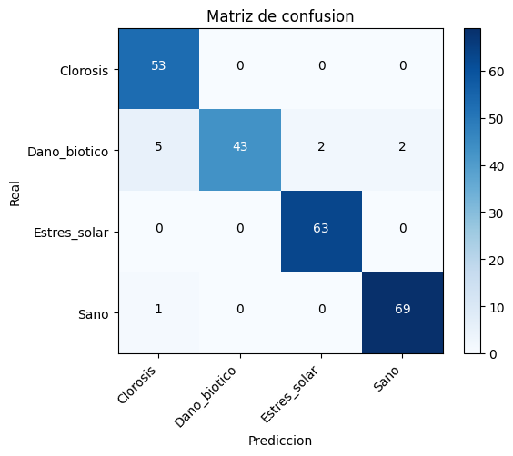
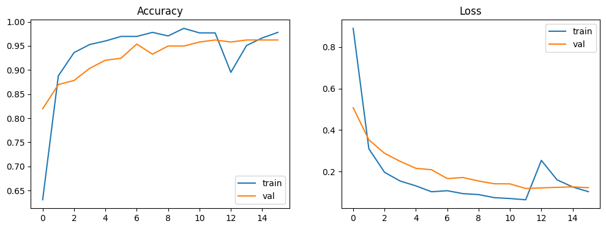

# Resultado 01 — Baseline sin RoCoLe

> Primer entrenamiento del modelo de visión de Yerbanalytics.
> **Fecha:** 2026-06-11 · **Notebook:** `yerbanalytics_baseline.ipynb` (versión inicial, sin RoCoLe).

## Veredicto en una línea

**Accuracy 96 % — pero el número es ENGAÑOSO por sesgo de dataset.** El pipeline funciona
y el modelo aprende, pero esta métrica **no predice** el desempeño sobre yerba real.

---

## 1. Setup

| Parámetro | Valor |
|---|---|
| Modelo | MobileNetV3-Large (transfer learning, ImageNet) |
| Framework | TensorFlow / Keras |
| Imagen | 224×224 |
| Entrenamiento | Fase 1 (cabeza) + Fase 2 (fine-tuning ~40 capas) |
| Donantes | Tea Leaf, CoLeaf, Tea Leaf Diseases (**sin RoCoLe**) |

### Dataset usado (equilibrado por submuestreo)

| Clase | Disponibles | Usadas | Fuente |
|---|---|---|---|
| Sano | 12.829 | 300 | Tea Leaf — Healthy |
| Clorosis | 291 | 291 | CoLeaf (café) |
| Dano_biotico | 67.500 | 300 | Tea Leaf — 5 enfermedades |
| Estres_solar | 1.712 | 300 | Tea Leaf Diseases — Sunlight Scorching |

---

## 2. Resultados

### Reporte de clasificación (validación, 238 imgs)

| Clase | Precision | Recall | F1 | Support |
|---|---|---|---|---|
| Clorosis | 0.90 | 1.00 | 0.95 | 53 |
| Dano_biotico | 1.00 | **0.83** | 0.91 | 52 |
| Estres_solar | 0.97 | 1.00 | 0.98 | 63 |
| Sano | 0.97 | 0.99 | 0.98 | 70 |
| **accuracy** | | | **0.96** | 238 |

### Matriz de confusión

| Real ↓ / Pred → | Clorosis | Dano_biotico | Estres_solar | Sano |
|---|---|---|---|---|
| **Clorosis** | 53 | 0 | 0 | 0 |
| **Dano_biotico** | 5 | 43 | 2 | 2 |
| **Estres_solar** | 0 | 0 | 63 | 0 |
| **Sano** | 1 | 0 | 0 | 69 |

### Curvas de entrenamiento

Train y validación van pegadas → **sin overfitting**. El bajón en la época 12 es el
arranque de la Fase 2 (fine-tuning, cambio de learning rate); se recuperó.

---

## 3. Análisis

### ⚠️ El 96 % es una trampa: sesgo de dataset (*shortcut learning*)

Cada clase proviene de un **dataset distinto** (Sano=Tea Leaf, Clorosis=CoLeaf café,
Dano_biotico=Tea Leaf enf., Estres_solar=Tea Leaf Diseases). Por eso el modelo
**puede estar aprendiendo a reconocer el dataset de origen** (fondo, iluminación, estilo
de foto) **en vez del síntoma**.

**Evidencia:** Clorosis y Estrés solar dan **100 % de recall, cero errores**. Esa
perfección es sospechosa — son las clases que vienen de datasets visualmente más
distintos, el atajo más fácil para el modelo.

**Consecuencia:** el set de validación sale de la **misma distribución sesgada** que el
entrenamiento, así que el 96 % sólo confirma que el modelo separa *estos* datasets entre
sí. **No dice nada sobre yerba real.**

### La señal que SÍ es real: Dano_biotico

Es la clase más débil (**recall 0.83**): 5 casos se fueron a Clorosis (amarilleo
confundido), 2 a Estrés solar, 2 a Sano. Es esperable y honesto: mete **5 enfermedades
distintas** en una sola bolsa → es la clase más heterogénea. La confusión
Daño biótico ↔ Clorosis es exactamente el riesgo que veníamos marcando.

---

## 4. Conclusión y próximos pasos

**Lo legítimo probado:** el pipeline es correcto y el modelo *puede* aprender. Ése era el
objetivo del baseline. **El número (96 %) no es de fiar.**

- [ ] Sumar **RoCoLe** (fondo de campo real) como mini-experimento: si la accuracy baja,
      confirma que el modelo se apoyaba en el fondo → **es buena noticia**.
- [ ] Validar contra **yerba real de Misiones** (la prueba honesta).
- [ ] Vigilar siempre la frontera **Daño biótico ↔ Clorosis**.
