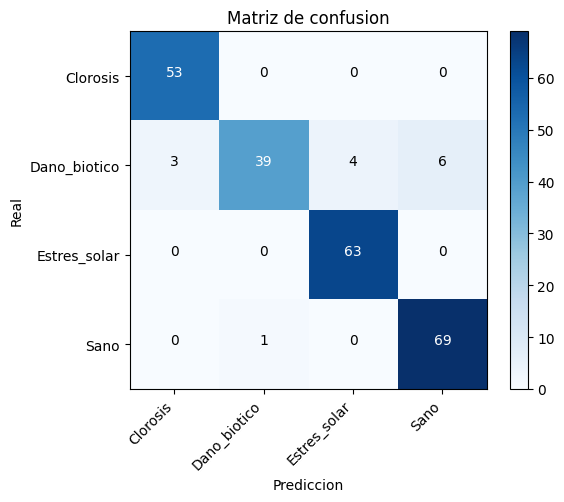
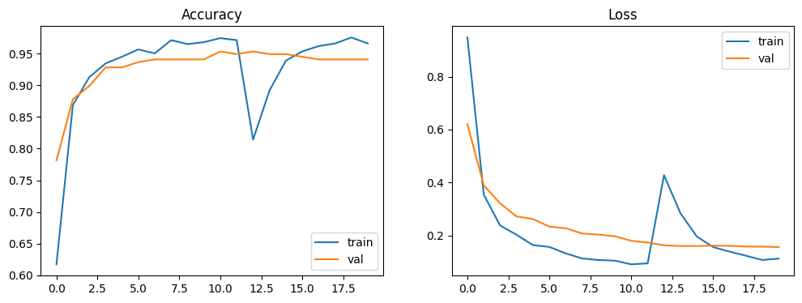

# Resultado 02 — Baseline con RoCoLe (fondo de campo real)

> Segundo entrenamiento del modelo de visión de Yerbanalytics.
> **Fecha:** 2026-06-11 · **Notebook:** `yerbanalytics_baseline.ipynb` (con RoCoLe integrado vía CSV, Camino B).

## Veredicto en una línea

**Accuracy 94 % — bajó 2 puntos respecto al 01, y eso es BUENA NOTICIA.** La caída se
concentra entera en `Dano_biotico`: al sumar fondo de campo real, el modelo dejó de
apoyarse en el atajo del fondo y se volvió más honesto.

---

## 1. Setup

| Parámetro | Valor |
|---|---|
| Modelo | MobileNetV3-Large (transfer learning, ImageNet) |
| Framework | TensorFlow / Keras |
| Imagen | 224×224 |
| Entrenamiento | Fase 1 (cabeza) + Fase 2 (fine-tuning ~40 capas) |
| Donantes | Tea Leaf, CoLeaf, Tea Leaf Diseases **+ RoCoLe (fondo real)** |

### Dataset usado (equilibrado por submuestreo)

| Clase | Disponibles | Usadas | Fuente |
|---|---|---|---|
| Sano | 13.620 | 300 | Tea Leaf — Healthy **+ RoCoLe healthy (+791 disp.)** |
| Clorosis | 291 | 291 | CoLeaf (café) |
| Dano_biotico | 68.269 | 300 | Tea Leaf — 5 enf. **+ RoCoLe ácaro/roya (+769 disp.)** |
| Estres_solar | 1.712 | 300 | Tea Leaf Diseases — Sunlight Scorching |

> **Caveat de dosis:** RoCoLe aportó 769 imgs a `Dano_biotico` sobre un pool de 68.269
> (~1 %) y 791 a `Sano` sobre 13.620 (~6 %). Con `SAMPLES_PER_CLASS=300`, al submuestrear
> entraron **~3 imgs de RoCoLe en Dano_biotico y ~17 en Sano**. El experimento está
> **sub-dosificado**: la señal apareció con una inyección mínima.

---

## 2. Resultados

### Reporte de clasificación (validación, 238 imgs)

| Clase | Precision | Recall | F1 | Support |
|---|---|---|---|---|
| Clorosis | 0.95 | 1.00 | 0.97 | 53 |
| Dano_biotico | 0.98 | **0.75** | 0.85 | 52 |
| Estres_solar | 0.94 | 1.00 | 0.97 | 63 |
| Sano | 0.92 | 0.99 | 0.95 | 70 |
| **accuracy** | | | **0.94** | 238 |

### Matriz de confusión

| Real ↓ / Pred → | Clorosis | Dano_biotico | Estres_solar | Sano |
|---|---|---|---|---|
| **Clorosis** | 53 | 0 | 0 | 0 |
| **Dano_biotico** | 3 | 39 | 4 | 6 |
| **Estres_solar** | 0 | 0 | 63 | 0 |
| **Sano** | 0 | 1 | 0 | 69 |

### Curvas de entrenamiento

Train y validación van pegadas → **sigue sin overfitting**. El pozo de la época ~12
(cae a ~0.81 y se recupera) es el arranque de la Fase 2 (fine-tuning, cambio de learning
rate); más profundo que en el 01 pero se recuperó igual.

---

## 3. Análisis

### La hipótesis del 01 se confirmó (en la dirección correcta)

En el 01 escribimos: *"si la accuracy baja al sumar RoCoLe, confirma que el modelo se
apoyaba en el fondo → es buena noticia"*. **Bajó: 96 → 94.** Y no bajó parejo: la caída
está **100 % concentrada en `Dano_biotico`** (recall 0.83 → 0.75), justo la clase donde
entró el fondo de campo real. El resto de las clases siguen casi perfectas.

### La pistola humeante: Dano_biotico → Sano

| Confusión | 01 | 02 |
|---|---|---|
| Dano_biotico → Sano | 2 | **6** |

RoCoLe metió fondo de campo real en **dos clases a la vez**: hojas sanas de café (a
`Sano`) y ácaro/roya (a `Dano_biotico`). Antes, cada clase venía de un dataset
visualmente distinto y el modelo tomaba el **atajo del fondo** ("fondo tipo X = clase X").
Ahora `Sano` y `Dano_biotico` **comparten fondo RoCoLe** → el atajo se rompió → el modelo
quedó obligado a mirar la **hoja**, no el fondo. Al mirar la hoja, se confunde más. Esa
confusión extra es el modelo volviéndose **honesto**, no peor.

### Lo que sigue sin probarse

La validación **sigue saliendo del mismo dominio donante** que el entrenamiento. El 94 %
mide separación entre datasets donantes, no desempeño sobre yerba. **No es el test
honesto.** Y la dosis de RoCoLe fue mínima (ver caveat) → la hipótesis está confirmada,
pero no a fondo.

---

## 4. Conclusión y próximos pasos

**Lo probado:** sumar fondo real, aun en dosis homeopática, mueve la métrica en la
dirección predicha y rompe el atajo del fondo en la clase tocada. El pipeline RoCoLe vía
CSV (Camino B) funciona.

- [ ] **Subir la dosis de RoCoLe** (oversampling o subir `SAMPLES_PER_CLASS`): si la
      accuracy baja MÁS, confirma la hipótesis con fuerza, no con la puntita.
- [ ] Validar contra **yerba real de Misiones** (la prueba honesta — sigue pendiente).
- [ ] Vigilar la frontera **Daño biótico ↔ Clorosis** (3 casos) y la nueva
      **Daño biótico ↔ Sano** (6 casos).
