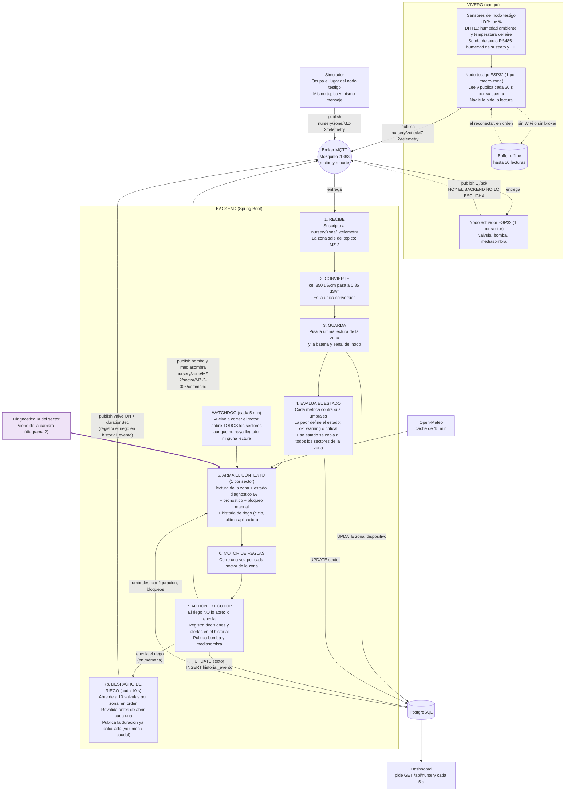
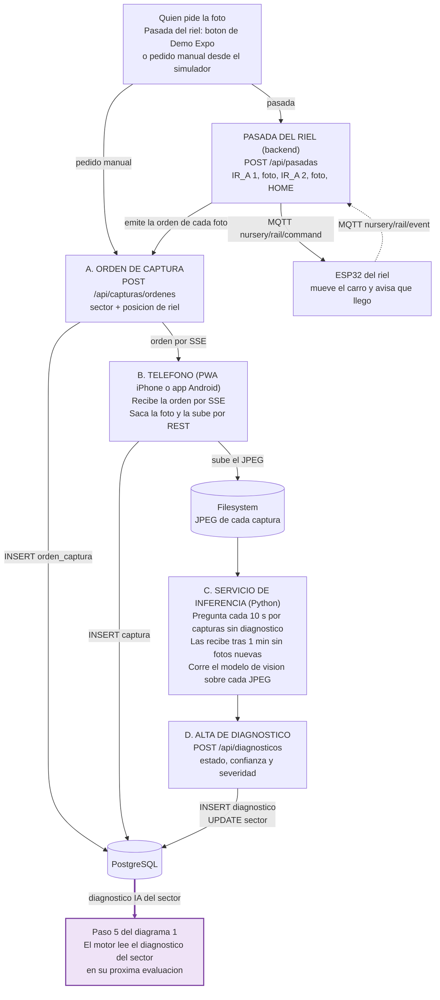
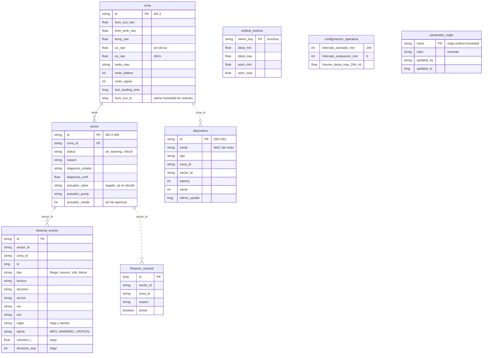

# Circuito de sensado: del sensor al motor de reglas

Cómo viaja una lectura desde el nodo testigo hasta que el motor de reglas decide y actúa, y por
dónde entra el diagnóstico de la cámara.
Todo sale de leer el código (firmware, backend, simulador, servicio de inferencia). Lo verificado en ejecución, y lo que no, está en `diferencias-motor-reglas-vs-reglas-v2.md` §7.
El interior del motor está en `diferencias-motor-reglas-vs-reglas-v2.md`.

Ejemplo que recorre los diagramas: **"MZ-2 se está secando"**.

---

## 1. Flujo completo

Para importar en draw.io: *Organizar → Insertar → Avanzado → Mermaid* y pegar el bloque.



El violeta marca el único punto donde entra la cámara: el diagnóstico de IA que el paso 5 suma
al contexto. De dónde sale está en el diagrama 2.

El riego es la excepción del paso 7: el Action Executor lo **encola** y lo abre el despacho (7b),
de a 10 válvulas por macro-zona, en orden de numeración de sector. Antes de abrir cada una revalida
con los datos de ese momento: humedad bajo el bloqueo por saturación, sin bloqueo manual y, para el
riego común, dentro de la ventana 06:00-18:00, fuera de la pausa tras una aplicación, sin lluvia
prevista y sin haber regado ya en el ciclo (para R-02, fuera de su tope de 12 h). Si el nodo no tiene
lectura vigente **pausa** la ronda y la retoma al volver; cada solicitud vence a los dos ciclos de
lectura. La bomba y la mediasombra siguen saliendo directo desde el paso 7.

## 1.b Captura y diagnóstico (la cámara)



La pasada va de punta a punta: el riel se mueve a la posición, el backend emite la orden de captura de ese
sector y, cuando la foto llega, pasa a la siguiente; ~1 min después de la última el servicio de inferencia
carga los diagnósticos. Probada con hardware real el 03/10/2026; límites de hardware conocidos en el
README de `vivero_esp32_red`.

Cargar un diagnóstico no dispara el motor: queda en el sector y las reglas lo leen en la
siguiente evaluación (con la próxima lectura o en el barrido del watchdog).

Tablas que toca este carril (la foto en sí va al filesystem):

| Tabla | Qué guarda |
|---|---|
| `orden_captura` | El pedido: sector, posición de riel, dispositivo, estado, intentos y vencimiento |
| `captura` | La metadata de la foto recibida: orden, sector, ruta del JPEG y horarios |
| `diagnostico` | El resultado: captura que cita, sector, estado, confianza y severidad |
| `sector` | Copia del último diagnóstico (`diagnosis_estado`, `diagnosis_conf`), que es lo que lee el motor |

---

## 2. Qué viaja por MQTT

| Dirección | Tópico | Quién publica | Quién escucha |
|---|---|---|---|
| Nodo → backend | `nursery/zone/{zona}/telemetry` | Nodo testigo o simulador | Backend |
| Backend → nodo | `nursery/zone/{zona}/sector/{sector}/command` | Backend (el riego, el despacho; bomba y mediasombra, el Action Executor) | Nodo actuador del sector |
| Nodo → backend | `nursery/zone/{zona}/sector/{sector}/ack` | Nodo actuador | **Nadie** (el backend no se suscribe) |
| Backend → riel | `nursery/rail/command` | Backend (la pasada: `IR_A` 1 o 2, `HOME`) | ESP32 del riel (`vivero_esp32_red`) |
| Riel → backend | `nursery/rail/event` | ESP32 del riel (`ACEPTADO`, `LLEGO`, `ERROR`) | Backend (`RielEventoReceiver`) |

**Telemetría** (lo que manda el nodo testigo de MZ-2):

```json
{
  "mac": "A4:CF:12:9A:00:01",
  "battery": 87,
  "signal": -62,
  "timestamp": 1782414800,   // segundos (firmware); el simulador manda ms. El backend acepta ambos
  "metrics": { "humSus": 32, "humAmb": 55, "temp": 31, "ce": 850, "uv": 78 }
}
```

- `humSus`, `humAmb`: %. `temp`: °C. `ce`: µS/cm. `uv`: **% de luz del LDR**, no radiación UV.
- `mac` no decide la zona: sólo sirve para actualizar la batería y señal del dispositivo registrado.
- Una métrica cuyo sensor falló no viaja, y el backend conserva el valor anterior.
- El firmware puede mandar además `tempSuelo`, `phSuelo`, `n`, `p`, `k`, pero viene apagado de
  fábrica (`ENVIAR_METRICAS_EXTENDIDAS 0`).

**Comando** (lo que publica el backend):

```json
{ "commandId": "<uuid>", "actuador": "valve", "accion": "ON", "parametros": { "durationSec": 600 } }
```

| Actuador | `accion` | `parametros` |
|---|---|---|
| `valve` | `ON` | `durationSec`: calculada, de 1 a 1200 s (600 s = 5 L a 30 L/h, humedad 40 %; R-02: 6 L = 720 s) |
| `pump` | `ON` | vacío (el firmware lo rechaza, ver sección 5) |
| `shade` | `SET` | `targetPct` |

---

## 3. Cada cuánto pasa cada cosa

| Qué | Cada cuánto | Dónde está definido |
|---|---|---|
| El nodo testigo lee y publica | 30 s | `SENSOR_POLLING_INTERVAL_MS`, `embebido/comun/config.example.h:49` |
| El simulador publica | 10 s al encenderlo; a los 5 s adopta `intervaloSensadoMinutos` de la base (**240 min**) | `simulador/server/emission.ts:35-47` |
| El backend procesa una lectura | Al instante, por cada mensaje (no hace polling) | `MqttTelemetryReceiver.processMessage` |
| El motor corre por telemetría | Con cada mensaje, sobre todos los sectores de esa zona | `NurseryService.updateTelemetry`, `NurseryService.java:541-590` |
| El motor corre por watchdog | 5 min (`intervaloEvaluacionMinutos`), sobre todo el vivero; no riega ni toca la cola | `NurseryWatchdog.java:83-104` |
| El despacho de riego abre válvulas | 10 s: cierra lo vencido y abre los sectores que entren en el cupo (10 por zona) | `yerbanalytics.riego.despacho-intervalo-ms`, `application.properties:103`; `DespachoRiego.java:254-255` |
| Se da un riego por terminado | A `ts + duración + 5 s`; el ESP32 cierra solo, el backend no manda orden de cierre | `DespachoRiego.java:104,436` |
| Ciclo de lectura del riego | Franjas de `intervaloSensadoMinutos` (240 min, acotado a 60-360) desde las 02:00: 02, 06, 10, 14, 18, 22 h. Un riego común por sector y ciclo | `CicloLectura.java:35-55` |
| Tope del déficit crítico (R-02) | 1 riego cada 12 h por sector (`riego.exceptuado-bloqueo`) | `DeficitCriticoRule.java:84-97` |
| Una zona pasa a "sin señal" | Si la última lectura **o** la última humedad de sustrato tienen más de 90 s (editable) | Parámetro `seguridad.antiguedad-max-lectura` (`ParametrosSeguridad.java:13-16`, `StaleSensorRule.java:64-93`) |
| Se mide la efectividad de una acción | Revisión cada 30 s; compara 2 min después de actuar (un riego, desde que se abre la válvula) | `HistorialService.java:265-290` |
| Pronóstico del clima | Caché de 15 min; un fallo se recuerda 60 s. La telemetría nunca espera: usa lo cacheado (hasta 4 TTL) y refresca aparte; se pide también al arrancar, con timeouts de 3 s y 5 s | `weather.cache-ttl-ms`, `weather.failure-cache-ttl-ms`, `application.properties:120,130`; `WeatherService.java:146-156` |
| El dashboard se refresca | 5 s | `frontend/src/hooks/NurseryContext.tsx:30` |
| Se pide una foto | Sólo cuando alguien emite la orden o dispara una pasada del riel; no hay pasada automática | `CapturaController.java:70`, `PasadaRielController.java:32` |
| La pasada espera al riel | Sin evento a los 5 s republica el comando; al doble, `RIEL_SIN_RESPUESTA`. Movimiento 120 s, foto 240 s | `yerbanalytics.pasada.*`, `application.properties:189-195` |
| Una orden sin imagen se reintenta | A los 60 s, hasta 3 intentos | `capturas.timeout-orden-seg`, `capturas.max-intentos`, `application.properties:145,147` |
| El servicio de inferencia busca capturas | Cada 10 s; el backend se las entrega tras 1 min sin capturas nuevas | `servicio-inferencia/src/main.py:148`, `src/api.py:48` |

---

## 4. Qué queda en la base



- **Sólo se guarda la última lectura.** Cada mensaje pisa las columnas `*_raw` de `zona`; no hay
  tabla de historial de lecturas. `historial_evento` es el registro de decisiones del motor, no
  de mediciones.
- La única relación real en la base es `zona` 1—N `sector`. Las líneas punteadas son ids de
  texto sin clave foránea.
- "Sin señal" no se guarda: se calcula al leer, comparando `last_reading_time` con la hora actual.
- `umbral_metrica` y `configuracion_operativa` son tablas sueltas de parámetros (la segunda
  tiene una sola fila). `umbral_metrica` sólo define el estado y el color de los sectores.
- Los umbrales que comparan las reglas (humedad de riego, lluvia, volumen, ventana, antigüedad de
  la lectura, etc.) viven en el catálogo de parámetros: los valores de fábrica están en el código y
  `parametro_regla` guarda sólo los overrides (`GET/PUT /api/rules/parametros`).
- La cola de riego y lo que está regando están en memoria; se reconstruyen del historial al
  reiniciar (`historial_evento`, tipo "Riego"), y lo pendiente se pierde.

**Cómo se decide el estado** (paso 4): fuera de la banda `ideal` es *warning*, fuera de la banda
`warn` es *critical*. Valores de fábrica para las métricas que mueven el estado:

| Métrica | Ideal | Warning hasta |
|---|---|---|
| `humSus` (%) | 42 – 68 | 32 – 80 |
| `humAmb` (%) | 62 – 84 | 52 – 91 |
| `temp` (°C) | 18 – 27 | 15 – 31 |
| `uv` (% luz) | 35 – 70 | 20 – 85 |
| `ce` (dS/m) | 1,0 – 1,9 | 0,8 – 2,5 |

En el ejemplo, `humSus = 32` cae fuera de la banda ideal: MZ-2 queda en *warning* y con ella
sus 100 sectores.

---

## 5. Lo que hoy no cierra

Lo resuelto va tachado; lo que sigue abierto, con su cita.

1. ~~**El `timestamp` del firmware está en segundos y el backend lo trataba como milisegundos.**~~
   **Resuelto** (`fix-integracion-nodo-real`): la ingesta lo normaliza por valor a ms
   (`ContratoNodo.timestampAMs`). Segundos epoch se multiplican por 1000, milisegundos se dejan;
   si el valor no sirve como fecha (nodo sin NTP, anterior a 2020) se usa la hora de recepción y
   se loguea un warn por zona. Una lectura más vieja que la guardada (buffer offline) se ignora
   (`NurseryService.java:463-482`).
2. ~~**El nodo publica cada 30 s y la zona se consideraba caída a los 30 s.**~~ **Resuelto**: el
   parámetro `seguridad.antiguedad-max-lectura` pasó de 30 a **90 s** (3 intervalos).
3. **El simulador baja solo a una lectura cada 4 h** (toma `intervaloSensadoMinutos`), y contra
   el umbral de 90 s la zona pasa casi todo el tiempo "sin señal": el riego queda bloqueado
   (`StaleSensorRule`). Para probar el riego con el simulador hay que acortar ese intervalo. Ese
   parámetro no llega al firmware: el nodo real sigue en 30 s.
4. **El ACK del actuador no lo escucha nadie** (el backend sí escucha `nursery/rail/event`, pero eso es el riel, no los actuadores). El backend da la válvula por abierta cuando el
   cliente MQTT aceptó el comando (`DespachoRiego.java:424-442`), no cuando el nodo confirmó. Ya no
   queda una válvula "enganchada" en "Regando": ese estado es `ts + duración + 5 s`
   (`DespachoRiego.java:214-221`) y se reconstruye del historial tras un reinicio. Sigue abierto
   que una orden perdida figure como riego hecho.
5. **El comando de la bomba sale sin mililitros** (`ActionExecutor.java:130`) y el firmware lo
   rechaza con `dosis_invalida` (`embebido/actuacion/act_bomba.cpp:24-27`). La bomba además
   conserva el enganche "Dosificando": tras la primera dosificación de un sector no se publican
   más comandos de bomba ni se registran más eventos "Insumo" (`ActionExecutor.java:126-131`), y
   la pausa de R-06 depende de esos eventos.
6. **No hay validación de rangos en la ingesta** (`NurseryService.java:488-507`) ni
   usuario/contraseña en el broker.
7. **Las fotos no se piden solas.** Hay pasada del riel a demanda (Demo Expo o `POST /api/pasadas`), pero
   ningún planificador la dispara: la spec v2 supone una pasada diaria a las 09:00. Además, con el
   final de carrera de home del riel en falso, entre pasadas hay que devolver el carro a home a mano.
8. **La telemetría puede pisar el diagnóstico de la cámara.** En cada lectura, si el estado del
   sector es `ok` el backend escribe "Sano" 98 %, y si pasa a un estado no saludable sin
   diagnóstico previo le asigna uno fijo con 92 % de confianza (`NurseryService.java:548-566`).
9. **Cargar un diagnóstico no dispara el motor.** Las reglas lo ven recién en la siguiente
   evaluación.
10. **Un sensor de humedad trabado en un valor seco haría regar en cada ciclo.** Sin E-01 ni S-06
    nada lo detecta: con la humedad fija en 40 %, R-01 riega ~5 L en cada ciclo de la ventana (06,
    10, 14 y 18 h), unos 20 L por día y por sector. El freno es la guarda de ciclo y, para R-02, el
    tope de 12 h. Una sonda que *deja de reportar* sí se detecta (la humedad vieja bloquea el
    riego). Antes de operar con plantines reales hay que resolverlo (E-01 + S-06 o un volumen
    máximo menor), según el diseño del cambio de riego.
11. **R-03 sin pronóstico no pospone.** Si falta el pronóstico (API caída o primer mensaje tras arrancar)
    R-01 riega (O-01, a propósito). El pronóstico se pide al arrancar y el despacho vuelve a mirar la
    lluvia antes de abrir cada válvula, así que una ronda encolada antes de que llegue el aviso de lluvia
    ya no se completa (`riego/DespachoRiego.java:487-493`, `WeatherService.java:146-156`).
12. **El cupo de 10 válvulas se llena por número de sector**, no por urgencia ni por humedad, y
    la cola vive en memoria: un reinicio la pierde y la siguiente telemetría vuelve a decidir.
13. **El firmware del nodo modular no se compiló** y nada de él se probó con hardware; el sketch del riel
    (`vivero_esp32_red`) sí se compiló, flasheó y probó: ver `conectar-esp32.md`.
