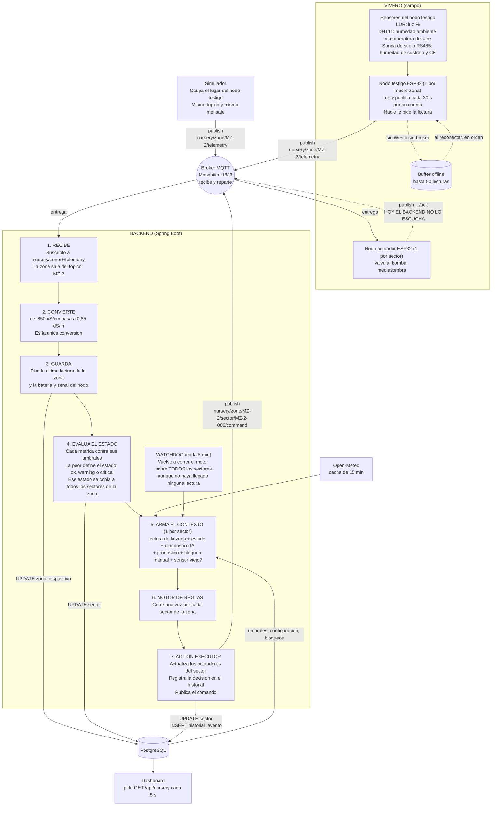
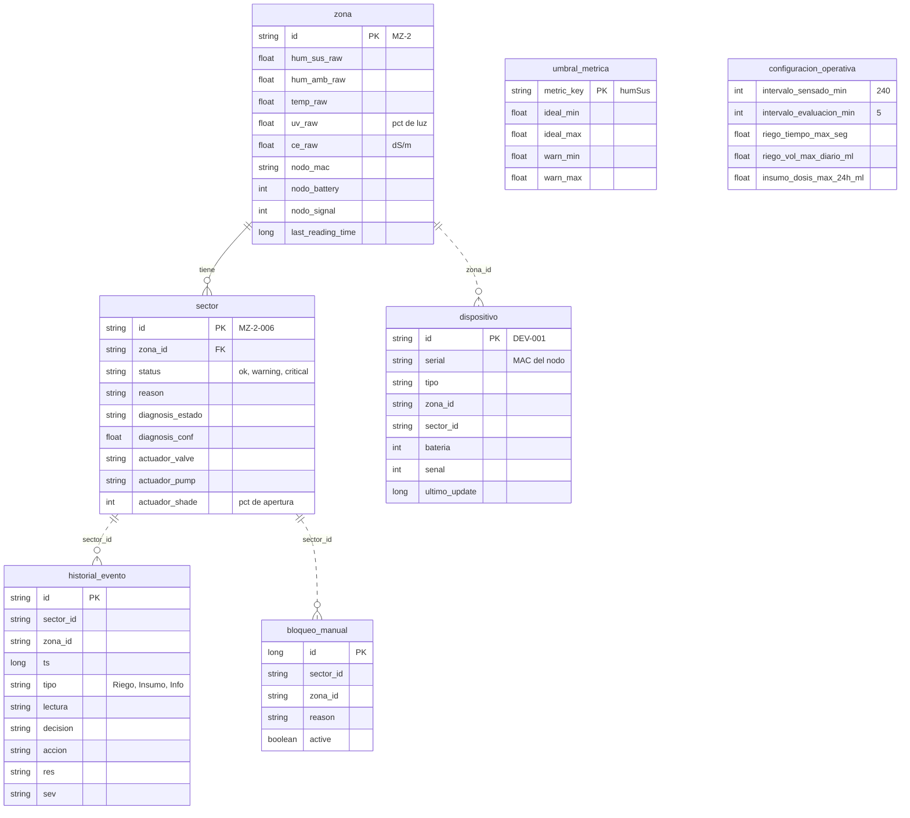

# Circuito de sensado: del sensor al motor de reglas

Cómo viaja una lectura desde el nodo testigo hasta que el motor de reglas decide y actúa.
Todo sale de leer el código de `develop` (firmware, backend, simulador); no se ejecutó nada.
El interior del motor está en `diferencias-motor-reglas-vs-reglas-v2.md`.

Ejemplo que recorre los diagramas: **"MZ-2 se está secando"**.

---

## 1. Flujo completo

Para importar en draw.io: *Organizar → Insertar → Avanzado → Mermaid* y pegar el bloque.



---

## 2. Qué viaja por MQTT

| Dirección | Tópico | Quién publica | Quién escucha |
|---|---|---|---|
| Nodo → backend | `nursery/zone/{zona}/telemetry` | Nodo testigo o simulador | Backend |
| Backend → nodo | `nursery/zone/{zona}/sector/{sector}/command` | Backend | Nodo actuador del sector |
| Nodo → backend | `nursery/zone/{zona}/sector/{sector}/ack` | Nodo actuador | **Nadie** (el backend no se suscribe) |

**Telemetría** (lo que manda el nodo testigo de MZ-2):

```json
{
  "mac": "A4:CF:12:9A:00:01",
  "battery": 87,
  "signal": -62,
  "timestamp": 1782414800,
  "metrics": { "humSus": 32, "humAmb": 55, "temp": 31, "ce": 850, "uv": 78 }
}
```

- `humSus`, `humAmb`: %. `temp`: °C. `ce`: µS/cm. `uv`: **% de luz del LDR**, no radiación UV.
- `mac` no decide la zona: sólo sirve para actualizar la batería y señal del dispositivo registrado.
- Una métrica cuyo sensor falló no viaja, y el backend conserva el valor anterior.
- El firmware puede mandar además `tempSuelo`, `phSuelo`, `n`, `p`, `k`, pero viene apagado de
  fábrica (`ENVIAR_METRICAS_EXTENDIDAS 0`).

**Comando** (lo que publica el backend):

```json
{ "commandId": "<uuid>", "actuador": "valve", "accion": "ON", "parametros": { "durationSec": 120 } }
```

| Actuador | `accion` | `parametros` |
|---|---|---|
| `valve` | `ON` | `durationSec` |
| `pump` | `ON` | vacío |
| `shade` | `SET` | `targetPct` |

---

## 3. Cada cuánto pasa cada cosa

| Qué | Cada cuánto | Dónde está definido |
|---|---|---|
| El nodo testigo lee y publica | 30 s | `SENSOR_POLLING_INTERVAL_MS`, `embebido/comun/config.example.h:49` |
| El simulador publica | 10 s al encenderlo; a los 5 s adopta `intervaloSensadoMinutos` de la base (**240 min**) | `simulador/server/emission.ts:35-47` |
| El backend procesa una lectura | Al instante, por cada mensaje (no hace polling) | `MqttTelemetryReceiver.processMessage` |
| El motor corre por telemetría | Con cada mensaje, sobre todos los sectores de esa zona | `NurseryService.java:509-510` |
| El motor corre por watchdog | 5 min (`intervaloEvaluacionMinutos`), sobre todo el vivero | `NurseryWatchdog.java:77-98` |
| Una zona pasa a "sin señal" | Si la última lectura tiene más de 30 s | `stale-threshold-ms`, `application.properties:69` |
| Se mide la efectividad de una acción | Revisión cada 30 s; compara 2 min después de actuar | `HistorialService.java:192-218` |
| Pronóstico del clima | Caché de 15 min | `weather.cache-ttl-ms`, `application.properties:121` |
| El dashboard se refresca | 5 s | `frontend/src/hooks/NurseryContext.tsx:30` |

---

## 4. Qué queda en la base



- **Sólo se guarda la última lectura.** Cada mensaje pisa las columnas `*_raw` de `zona`; no hay
  tabla de historial de lecturas. `historial_evento` es el registro de decisiones del motor, no
  de mediciones.
- La única relación real en la base es `zona` 1—N `sector`. Las líneas punteadas son ids de
  texto sin clave foránea.
- "Sin señal" no se guarda: se calcula al leer, comparando `last_reading_time` con la hora actual.
- `umbral_metrica` y `configuracion_operativa` son tablas sueltas de parámetros (la segunda
  tiene una sola fila).

**Cómo se decide el estado** (paso 4): fuera de la banda `ideal` es *warning*, fuera de la banda
`warn` es *critical*. Valores de fábrica para las métricas que mueven el estado:

| Métrica | Ideal | Warning hasta |
|---|---|---|
| `humSus` (%) | 42 – 68 | 32 – 80 |
| `humAmb` (%) | 62 – 84 | 52 – 91 |
| `temp` (°C) | 18 – 27 | 15 – 31 |
| `uv` (% luz) | 35 – 70 | 20 – 85 |
| `ce` (dS/m) | 1,0 – 1,9 | 0,8 – 2,5 |

En el ejemplo, `humSus = 32` cae fuera de la banda ideal: MZ-2 queda en *warning* y con ella
sus 100 sectores.

---

## 5. Lo que hoy no cierra

Cosas que el diagrama muestra tal cual están, y que conviene tener presentes:

1. **El `timestamp` del firmware está en segundos y el backend lo trata como milisegundos.**
   `reloj::ahoraEpoch()` devuelve segundos (`embebido/comun/reloj.cpp:51-58`); el backend lo
   guarda y lo resta de `System.currentTimeMillis()` (`NurseryService.java:444,96`). Con un nodo
   real la zona quedaría siempre "sin señal". El simulador manda milisegundos, por eso con él
   funciona. Sale de leer el código; no se probó con hardware.
2. **El nodo publica cada 30 s y la zona se considera caída a los 30 s.** No hay margen: un
   mensaje demorado la marca "sin señal".
3. **El simulador baja solo a una lectura cada 4 h** (toma `intervaloSensadoMinutos`), y contra
   el umbral de 30 s la zona pasa casi todo el tiempo "sin señal". Ese parámetro no llega al
   firmware: el nodo real sigue en 30 s.
4. **El ACK del actuador no lo escucha nadie.** El backend marca "Regando" al publicar el
   comando, sin confirmación del hardware.
5. **El comando de la bomba sale sin mililitros** (`ActionExecutor.java:94`) y el firmware lo
   rechaza con `dosis_invalida` (`embebido/actuacion/act_bomba.cpp:24-27`).
6. **No hay validación de rangos en la ingesta** ni usuario/contraseña en el broker.
