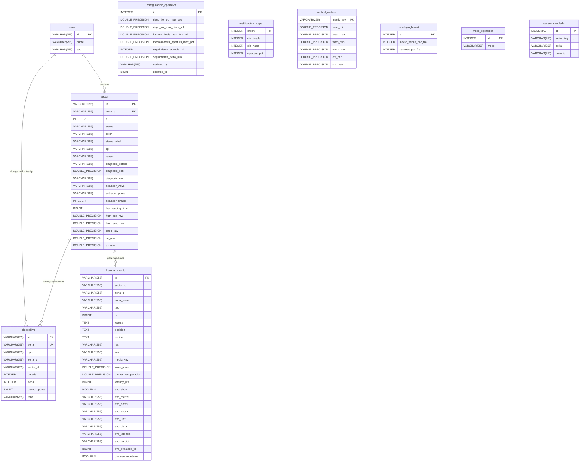

# Contexto: Persistencia Física y DER

## Tablas de Base de Datos
Las entidades agregadas previamente carecían de scripts físicos de base de datos. En este cambio, se creó un archivo `schema.sql` que materializa el modelo productivo y se removió la persistencia de las variables de simulación que ensuciaban la base de datos.

## Diagrama Entidad-Relación (DER)

A continuación se muestra el esquema físico de la base de datos en PostgreSQL, denotando las relaciones entre zonas, sectores, dispositivos de hardware, y entidades misceláneas de configuración y registro:

