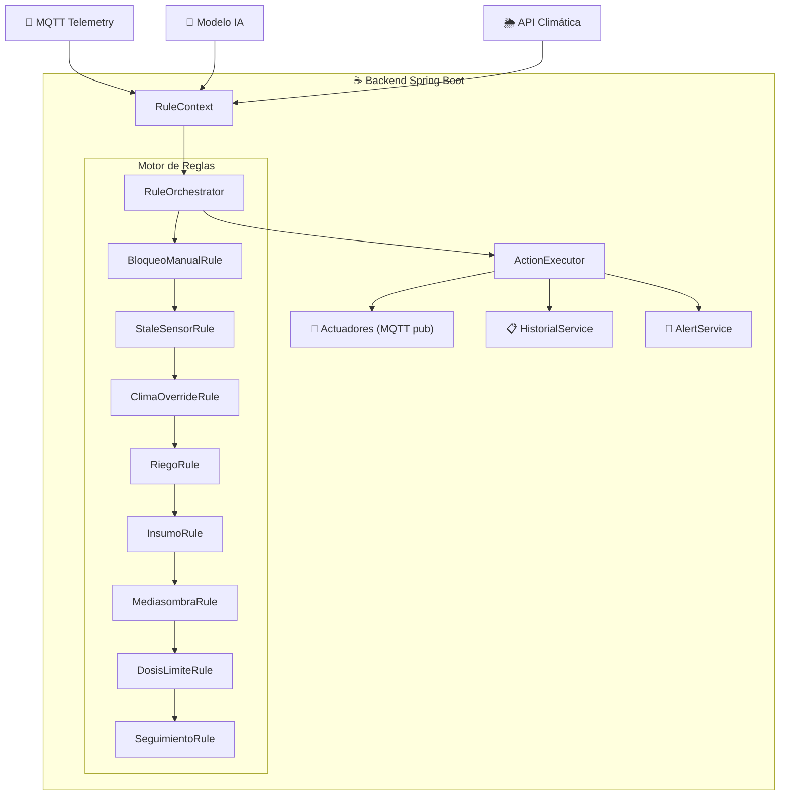
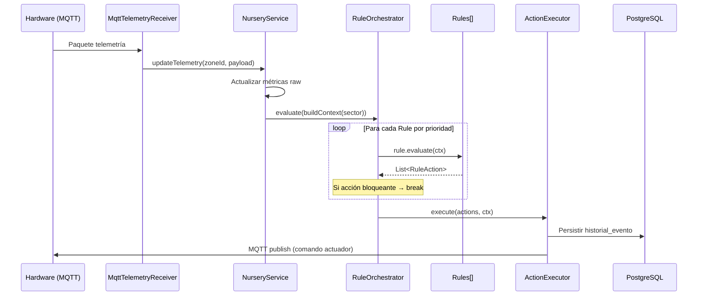

# Contexto: Motor de Reglas

## Problema

La lógica de decisión del sistema está embebida en `NurseryService.updateTelemetry()`, un método monolítico de ~90 líneas que mezcla actualización de métricas, evaluación de umbrales, control de actuadores y registro de historial. Esto impide:

1. **Testear** una regla de negocio de forma aislada.
2. **Componer** reglas complejas (ej. "regar solo si no hay lluvia inminente Y no hay bloqueo manual").
3. **Extender** el motor sin modificar código existente (principio Open-Closed).
4. **Trazar** qué regla produjo cada acción en el historial (HU-11 CA-01).

## Arquitectura propuesta

El motor extrae la lógica de decisión en componentes autocontenidos que se encadenan mediante un orquestador:



## Componentes clave

### RuleContext (Value Object inmutable)

Snapshot de todo lo que una regla necesita para decidir. Se construye una vez por ciclo de evaluación. Ninguna regla lo modifica; solo emite acciones.

| Campo | Tipo | Fuente |
|-------|------|--------|
| `sector` | `SectorEntity` | BD (métricas, actuadores, diagnóstico) |
| `zona` | `ZonaEntity` | BD |
| `specs` | `List<MetricSpec>` | `ConfiguracionService.getEffectiveSpecs()` |
| `metrics` | `List<Metric>` | Evaluación de valores raw contra specs |
| `config` | `ConfiguracionOperativaEntity` | BD (límites operativos) |
| `forecast` | `WeatherForecast` | `WeatherService` (puede ser null) |
| `diagnosis` | `DiagnosisResult` | Modelo IA (puede ser null) |
| `bloqueoManualActivo` | `boolean` | Tabla `bloqueo_manual` |
| `sensorStale` | `boolean` | Comparación de `last_reading_time` vs umbral |
| `now` | `Instant` | Reloj del sistema |

### Reglas y prioridades

| Prioridad | Regla | Release | HU | Efecto |
|-----------|-------|---------|-----|--------|
| 0 | `BloqueoManualRule` | R3 | HU-19 | `ABORT_ALL` — cancela toda actuación |
| 1 | `StaleSensorRule` | R1 | HU-02 | `ABORT_RIEGO` — no actuar sin datos frescos |
| 2 | `ClimaOverrideRule` | R2 | HU-09 | `POSTPONE_RIEGO` — lluvia inminente |
| 5 | `DosisLimiteRule` | R3 | HU-07 | `BLOQUEAR_DOSIFICACION` — máx 24h alcanzado |
| 10 | `RiegoRule` | R3 | HU-06 | `ACTIVAR_VALVULA` |
| 11 | `InsumoRule` | R3 | HU-07 | `ACTIVAR_BOMBA` |
| 12 | `MediasombraRule` | R3 | HU-08 | `MOVER_MEDIASOMBRA` |
| 20 | `SeguimientoRule` | R4 | HU-12 | `EVALUAR_EFECTIVIDAD` |

**Reglas de prioridad baja (0-5)** son bloqueantes: si se activan, las posteriores no se evalúan para ese sector.

**Reglas de prioridad alta (10+)** son ejecutoras: producen acciones concretas sobre actuadores.

### ActionExecutor

Único punto donde las acciones se convierten en efectos:

1. **MQTT publish** al broker → comanda actuadores físicos.
2. **Persistencia** en `historial_evento` con cadena `Lectura → Decisión → Acción`.
3. **Emisión de alertas** clasificadas por severidad (INFO / WARNING / CRITICAL).
4. **Actualización** de campos del sector (`actuador_valve`, `actuador_pump`, `actuador_shade`).

### WeatherService (HU-09)

```
Consulta asíncrona (timeout 10s)
  → OK: cache local del forecast
  → Timeout 15s: retry x3 (exponential backoff)
    → 3 fallos: forecast = null + warning de degradación
```

Cuando `forecast == null`, la `ClimaOverrideRule` no se activa y el motor opera exclusivamente con sensores físicos (HU-09 CA-03).

## Flujo de evaluación



## Tabla nueva requerida

Se crea con el **patrón real del repo**: una entidad JPA que Hibernate
materializa vía `ddl-auto=update` (no hay `schema.sql`; el `data.sql` solo
siembra datos). Se agrega `BloqueoManualEntity` + `BloqueoManualRepository`.

```java
@Entity
@Table(name = "bloqueo_manual")
public class BloqueoManualEntity {
    @Id @GeneratedValue(strategy = GenerationType.IDENTITY)
    private Long id;
    private String sectorId;          // null = bloquea toda la zona
    private String zonaId;
    private String activadoPor;
    private Long activadoTs;
    private String motivo;
    private Boolean activo = Boolean.TRUE;
}
```

## Relación con tablas existentes

El motor consume las tablas existentes sin modificarlas:

| Tabla | Rol |
|-------|-----|
| `sector` | Estado actual (métricas, actuadores, diagnóstico) |
| `umbral_metrica` | Bandas para evaluar métricas |
| `configuracion_operativa` | Límites máximos de actuación |
| `rustificacion_etapa` | Plan de mediasombra por días |
| `historial_evento` | Destino de acciones ejecutadas |
| `dispositivo` | Estado técnico del hardware |
